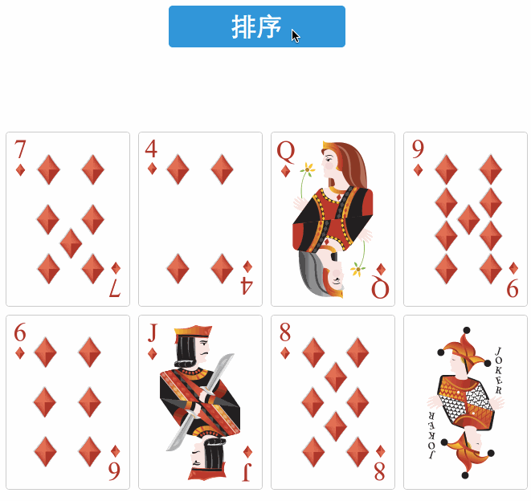

数组随机排序
===

经典的蜘蛛牌游戏中的洗牌：



下面介绍各种随机洗牌的实现。

1. 最简单的数组随机排序
```js
function randomSort(a, b) {
    return Math.random() > 0.5 ? -1 : 1;
}

var arr = [1, 2, 3, 4, 5, 6, 7, 8, 9];
arr.sort(randomSort);
```

由于 `sort()` 方法依次比较内部元素，因此这种排序方法并不是完全随机的。

2. 递归排序
```js
function randomSort(arr, newArr) {
    if (arr.length == 1) {
        newArr.push(arr[0]);
        return newArr;
    }

    var random = Math.ceil(Math.random() * arr.length) - 1;

    newArr.push(arr[random]);
    arr.splice(random, 1);

    return randomSort(arr, newArr);
}

for (var i = 0; i < 10; i++) {
    var arr = [1, 2, 3, 4, 5, 6, 7, 8, 9];
    var newArr = [];
    randomSort(arr, newArr);
    console.log(newArr);
}
```

3. 使用数组 sort 方法对数组元素随机排序
```js
Array.prototype.shuffle = function (n) {
    var len = this.length,
        num = n ? Math.min(n, len) : len,
        arr = this.slice(0);

    arr.sort(function (a, b) {
        return Math.random() - 0.5;
    });

    return arr.slice(0, num - 1);
}

var arr = [1, 2, 3, 4, 5, 6, 7, 8, 9];
arr.shuffle();
```

4. 随机交换数组内的元素
```js
var lib = {};
lib.range = function (min, max) {
    return min + Math.floor(Math.random() * (max - min + 1));
}
Array.prototype.shuffle = function (n) {
    var len = this.length,
        num = n ? Math.min(n, len) : len,
        arr = this.slice(0),
        temp, index;

    for (var i = 0; i < len; i++) {
        index = lib.range(i, len - 1);
        temp = arr[i];
        arr[i] = arr[index];
        arr[index] = temp;
    }

    return arr.slice(0, num);
}
```

5. 随机从原数组抽取一个元素，加入到新数组
```js
var lib = {};
lib.range = function (min, max) {
    return min + Math.floor(Math.random() * (max - min + 1));
}
Array.prototype.shuffle = function (n) {
    var len = this.length,
        num = n ? Math.min(n, len) : len,
        arr = this.slice(0),
        result = [],
        index;

    for (var i = 0; i < num; i++) {
        index = lib.range(0, len - 1 - i);
        // 或者 result.concat(arr.splice(index,1))
        result.push(arr.splice(index, 1)[0]);
    }

    return result
}
```

6. underscore.js 中的 shuffle 方法 - 洗牌算法
```js
function random(min, max) {
    if (max == null) {
        max = min;
        min = 0;
    }

    return min + Math.floor(Math.random() * (max - min + 1));
};

function shuffle(arr) {
    var length = arr.length,
        shuffled = Array(length);

    for (var index = 0, rand; index < length; index++) {
        rand = random(0, index);

        if (rand !== index) {
            shuffled[index] = shuffled[rand];
        }

        shuffled[rand] = arr[index];
    }

    return shuffled;
}
```

7. 简化版洗牌算法
```js
function shuffle(arr) {
    var i, j, temp;

    for (i = arr.length - 1; i > 0; i--) {
        j = Math.floor(Math.random() * (i + 1));
        temp = arr[i];
        arr[i] = arr[j];
        arr[j] = temp;
    }

    return arr;
};
```