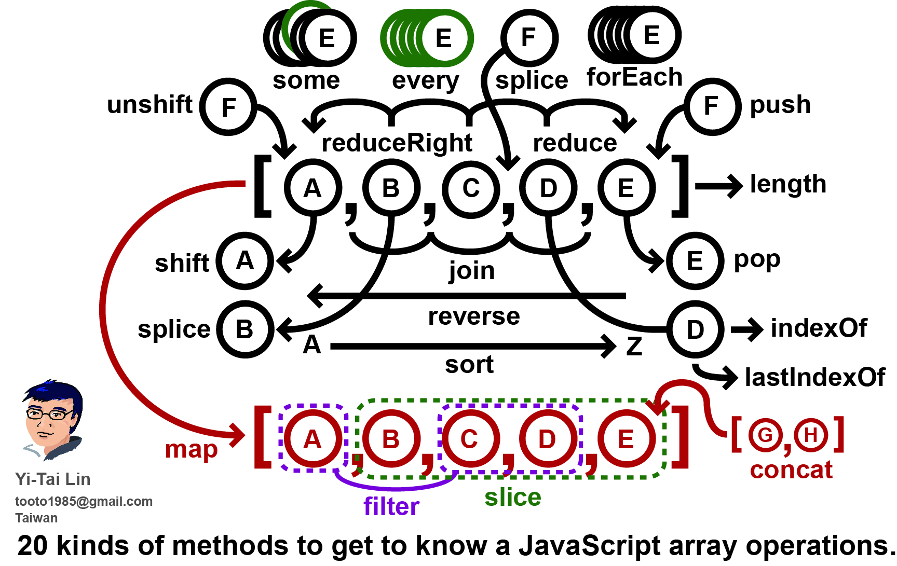

数组求和
===

JavaScript 中数组有很多种方法，下图能更好的向你阐述 JavaScript 有多少种方法：




## 数组求和
数组求和的方法很多，下面一一来介绍。

1. for 循环
```js
(function () {
    var arr = [0, 1, 2, 3, 4, 5, 6, 7, 8, 9];
    var sum = 0;

    function getSum(array) {
        for (var i = 0; i < array.length; i++) {
            sum += parseInt(array[i]);
        }

        return sum;
    }

    console.time("getSum");

    for (var i = 0; i < 1000000; i++) {
        sum = 0;
        getSum(arr);
    }

    console.timeEnd("getSum"); // getSum: 24.195068359375ms
    console.log("使用for循环:sum = " + sum); // 使用for循环:sum = 45
})();
```

2. while 循环
```js
(function () {
    var arr = [0, 1, 2, 3, 4, 5, 6, 7, 8, 9];
    var sum = 0;

    function getSum(array) {
        var i = array.length;

        while (i--) {
            sum += parseInt(array[i]);
        }

        return sum;
    }

    console.time("getSum");

    for (var i = 0; i < 1000000; i++) {
        var sum = 0;
        getSum(arr);
    }

    console.timeEnd("getSum"); // getSum: 25.614990234375ms
    console.log("使用while循环：sum=" + sum); // 使用while循环：sum=45
})();
```

3. forEach() 方法
```js
(function () {
    var arr = [0, 1, 2, 3, 4, 5, 6, 7, 8, 9];
    var sum = 0;

    function getSum(item, index, array) {
        sum += item;
    }

    console.time("getSum");

    for (var i = 0; i < 1000000; i++) {
        var sum = 0;
        arr.forEach(getSum);
    }

    console.timeEnd("getSum"); // getSum: 86.325927734375ms
    console.log("使用forEach循环：sum=" + sum); // 使用forEach循环：sum=45
})();
```

4. some() 方法
```js
(function () {
    var arr = [0, 1, 2, 3, 4, 5, 6, 7, 8, 9];
    var sum = 0;

    function getSum(item, index, array) {
        sum += item;
    }

    console.time("getSum");

    for (var i = 0; i < 1000000; i++) {
        var sum = 0;
        arr.some(getSum);
    }

    console.timeEnd("getSum"); // getSum: 120.548828125ms
    console.log("使用some循环：sum=" + sum); // 使用some循环：sum=45
})();
```

5. map() 方法
```js
(function () {
    var arr = [0, 1, 2, 3, 4, 5, 6, 7, 8, 9];
    var sum = 0;

    function getSum(item, index, array) {
        sum += item;
    }

    console.time("getSum");

    for (var i = 0; i < 1000000; i++) {
        var sum = 0;
        arr.map(getSum);
    }

    console.timeEnd("getSum"); // getSum: 153.48095703125ms
    console.log("使用map循环：sum=" + sum); // 使用map循环：sum=45
})();
```

6. filter() 方法
```js
(function () {
    var arr = [0, 1, 2, 3, 4, 5, 6, 7, 8, 9];
    var sum = 0;

    function getSum(item, index, array) {
        sum += item;
    }

    console.time("getSum");

    for (var i = 0; i < 1000000; i++) {
        var sum = 0;
        arr.filter(getSum);
    }

    console.timeEnd("getSum"); // getSum: 120.1728515625ms
    console.log("使用filter循环：sum=" + sum); // 使用filter循环：sum=45
})();
```

7. every() 方法
```js
(function () {
    var arr = [0, 1, 2, 3, 4, 5, 6, 7, 8, 9];
    var sum = 0;

    function getSum(item, index, array) {
        sum += item;
        return true; //由于 every 方法是会在遇到回调函数返回的第一个 false 时停止遍历所以需要始终返回 true
    };

    console.time("getSum");

    for (var i = 0; i < 1000000; i++) {
        sum = 0;
        arr.every(getSum);
    }

    console.timeEnd("getSum"); // getSum: 121.515869140625ms
    console.log("使用every循环:sum = " + sum); // 使用every循环:sum = 45
})();
```

8. reduce() 方法
```js
var arr = [0, 1, 2, 3, 4, 5, 6, 7, 8, 9];

function getSum(preValue, curValue, index, array) {
    return preValue + curValue;
}

console.time("getSum");

for (var i = 0; i < 1000000; i++) {
    sum = arr.reduce(getSum, 0)
}

console.timeEnd("getSum"); // getSum: 107.908935546875ms
console.log("使用reduce循环:sum = " + sum); // 使用reduce循环:sum = 45
```