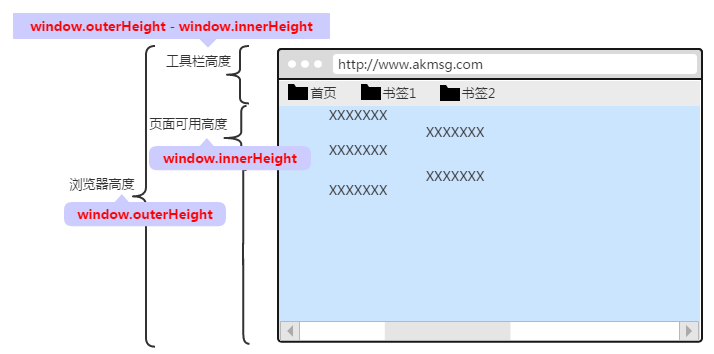
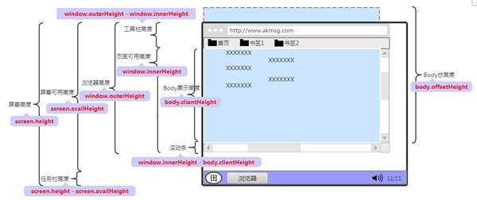
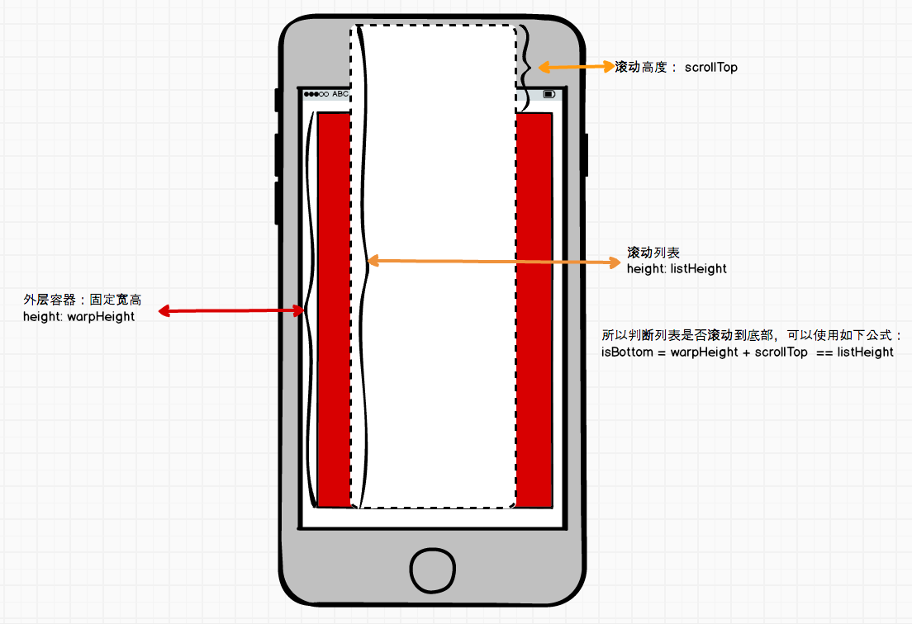

视口宽高、位置与滚动高度
===


## window 和 document
`window` 对象表示一个包含 DOM 文档的窗口，其 `document` 属性指向窗口中截入的 [DOM 文档](https://developer.mozilla.org/zh-CN/docs/Web/API/Document_Object_Model)。`window` 对象实现了 `Window` 接口。一些额外的全局函数、命名空间、对象、接口和构造函数与 `window` 没有典型的关联，但却是有效的，它们在 [JavaScript 参考](https://developer.mozilla.org/zh-CN/docs/Web/JavaScript/Reference) 和 [DOM 参考](https://developer.mozilla.org/zh-CN/docs/Web/API/Document_Object_Model) 中列出。

`Document` 接口提供了一些在浏览器服务中作为页面内容入口点而加载的一些页面，也就是 DOM 树。DOM 树包括诸如 `<body>`、`<head>` 以及其他元素。其也为 `document` 提供了全局性的函数，例如获取页面的 `URL`，在文档中创建新的元素的函数。

两者之间的区别：

* `Window` 对象表示浏览器中打开的窗口；`window` 对象可以省略。比如 `alert()`、`window.alert()`
* `Document` 对象是 `Window` 对象的一部分。那么 `document.body` 就可以写成 `window.document.body`。浏览器的 HTML 文档成为 `Document` 对象


## 视口宽高
这里的视口指的是浏览器窗口。

在 JavaScript 中，可以通过 `window.innerHeight` 和 `window.outerHeight` 获取整个窗口的高度，`window.innerWidth` 和 `window.outerWidth` 获取整个窗口的宽度。



上图展示的是浏览器视口的高度的。

| 属性名 | 描述 | 备注 |
| --- | --- | --- |
| window.innerHeight | 浏览器窗口高度，如果存在水平滚动条，则包括滚动条 | 只读属性，没有默认值 |
| window.outerHeight | 浏览器窗口整个高度，包括窗口标题、工具栏、状态栏等 | 只读属性，没有默认值 |
| window.innerWidth | 浏览器窗口宽度，如果存在垂直滚动条，则包括滚动条 | 只读属性，没有默认值 |
| window.outerWidth | 浏览器窗口整个宽度，包括侧边栏，窗口镶边和调正窗口大小的边框 | 只读属性，没有默认值 |

> 注意：IE8 及以下版本不支持 `window.innerHeight` 和 `window.innerWidth` 等属性。

对于不支持 `window.innerHeight` 等属性的浏览器中，可以读取 `documentElement` 和 `body` 的高度。它们的大小和 `window.innerHeight` 是一样的。事实上也略有不同。
```js
document.documentElement.clientHeight
document.body.clientHeight
```

其中 `documentElement` 是文档根元素，就是 `<html>` 标签; `body` 就是 `<body>` 元素。

而 `document.documentElement.clientHeight` 和 `document.body.clientHeight` 区别在于：

* `document.documentElement.clientHeight`：不包括整个文档的滚动条，但包括 `<html>` 元素的边框
* `document.body.clientHeight`：不包括整个文档的滚动条，也不包括 `<html>` 元素的边框，也不包括 `<body>` 的边框和滚动条

挂靠在 `window` 下的宽高还有 `window.screen`，`window.screen` 包含有关于用户屏幕的信息。它包括：

* `window.screen.width`：显示器屏幕的宽度
* `window.screen.height`：显示器屏幕的高度
* `window.screen.availHeight`：浏览器窗口在屏幕上可占用的垂直空间，即最大高度
* `window.screen.availWidth`：返回浏览器窗口可占用的水平宽度
* `window.screenTop`：浏览器窗口在屏幕上的可占用空间上边距离屏幕上边界的距离
* `window.screenLeft`：返回浏览器可用空间左边距离屏幕（系统桌面）左边界的距离

除此之外，还有偏移量的控制：

`offsetHeight`：元素的像素高度，高度包含该元素的垂直内边距和边框，且是一个整数。通常，元素的 `offsetHeight` 是一种元素 CSS 高度的衡量标准，包括元素的边框、内边距和元素的水平滚动条（如果存在且渲染的话），不包含 `:before` 或 `:after` 等伪类元素的高度。对于文档的 `body` 对象，它包括代替元素的 CSS 高度线性总含量高。浮动元素的向下延伸内容高度是被忽略的。

`offsetWidth`：一个元素的布局宽度。`offsetWidth` 是测量包含元素的边框、水平线上的内边距、竖直方向滚动条以及 CSS 设置的宽度的值。

`offsetLeft`：当前元素左上角相对于 `offsetParent` 节点的左边界偏移的像素值。对块级元素来说，`offsetTop`、`offsetLeft`、`offsetWidth` 及 `offsetHeight` 描述了元素相对于 `offsetParent` 的边界框。然而，对于可被截断到下一行的行内元素（如 `span`），`offsetTop` 和 `offsetLeft` 描述的是第一个边界框的位置（使用 `Element.getClientRects()` 来获取其宽度和高度），而 `offsetWidth` 和 `offsetHeight` 描述的是边界框的尺寸（使用 `Element.getBoundingClientRect` 来获取其位置）。因此，使用 `offsetLeft`、`offsetTop`、`offsetWidth`、`offsetHeight` 来对应 `left`、`top`、`width` 和 `height` 的一个盒子将不会是文本容器 `span` 的盒子边界。

`offsetTop`：当前元素相对于其 `offsetParent` 元素的顶部的距离。

`offsetParent`：返回一个指向最近的（`closest`，指包含层级上的最近）包含该元素的定位元素。如果没有定位的元素，则 `offsetParent` 为最近的 `table` 元素对象或根元素（标准模式下为 `html`；怪异模式下为 `body`）。当元素的 `style.display` 设置为 `none` 或定位为 `fixed` 时，`offsetParent` 返回 `null`。



基于浏览器的标准模式，我们可以进行常用位置和大小的计算。


### 浏览器可视区宽高
```js
let height = window.innerHeight || document.documentElement.clientHeight || document.body.clientHeight;
let width = window.innerWidth || document.documentElement.clientWidth || document.body.clientWidth;
```


### 元素距离文档顶部距离
当 `offsetParent` 为 `body` 时，可以通过 `el.offsetTop` 确定元素距离文档顶部大小。当 `offsetParent` 不为 `body` 时，就需要一层层循环至 `offsetParent` 为 `null`。
```js
function getTop(el) {
    let top = el.offsetTop;
    let currentParent = el.offsetParent;

    while (currentParent != null) {
        top += currentParent.offsetTop;
        currentParent = currentParent.offsetParent;
    }

    return top;
}
```


### 元素距离文档左侧距离
元素距离文档左侧距离实现思路和上面的元素距离文档顶部距离的类似。当 `offsetParent` 为 `body` 时，可以通过 `el.offsetLeft` 确定元素距离文档顶部大小。当`offsetParent` 不为 `body` 时，就需要一层层循环至 `offsetParent` 为 `null`。
```js
function getLeft(el) {
    let left = el.offsetLeft;
    let currentParent = el.offsetParent;

    while (currentParent != null) {
        left += currentParent.offsetLeft;
        currentParent = currentParent.offsetParent;
    }

    return left
}
```


## 滚动高度
与滚动 `scroll` 相关的方法主要有 `window` 对象下的 `scrollX`、`scrollY`、`scrollTo` 和 `scroll`；`Element` 对象下的 `scrollWidth`、`scrollHeight`、`scrollLeft` 和 `scrollTop`。

| 属性名称 | 描述 | 备注 |
| --- | --- | --- |
| `scrollX` | 返回文档/页面水平方向滚动的像素值 | `pageXOffset` 是 `scrollX` 的别名 |
| `scrollY` | 返回文档在垂直方向已滚动的像素值 | `pageYOffset` 是 `scrollY` 的别名 |
| `scrollTo` | 滚动到文档中的某个坐标 | 该函数实际上和 `window.scroll` 是一样的 |
| `scroll` | 滚动窗口至文档中的特定位置 | `window.scrollTo` 同样能高效地完成同样的任务 |
| `scrollWidth` | 返回元素的内容区域宽度或元素的本身的宽度中更大的那个值 | 若元素的宽度大于其内容的区域（例如，元素存在滚动条时）, `scrollWidth` 的值要大于 `clientWidth` |
| `scrollHeight` | 一个元素内容高度的度量，包括由于溢出导致的视图中不可见内容 | 没有垂直滚动条的情况下，`scrollHeight` 值与元素视图填充所有内容所需要的最小值 `clientHeight` 相同。包括元素的 `padding`，但不包括元素的 `border` 和 `margin` |
| `scrollLeft` | 可以读取或设置元素滚动条到元素左边的距离 | 如果这个元素的内容排列方向（direction） 是 rtl (right-to-left) ，那么滚动条会位于最右侧（内容开始处），并且 `scrollLeft` 值为 `0`。此时，当你从右到左拖动滚动条时，`scrollLeft` 会从 `0` 变为负数 |
| `scrollTop` | 可以获取或设置一个元素的内容垂直滚动的像素数 | 一个元素的 `scrollTop` 值是这个元素的顶部到它的最顶部可见内容（的顶部）的距离的度量。当一个元素的内容没有产生垂直方向的滚动条，那么它的 `scrollTop` 值为 `0` |

`window.scrollX` 和 `window.scrollY` 两个属性在 IE9 以下的版本都未支持。如果我们要获取页面垂直和水平的滚动距离，我们一般这样来处理：
```js
// 判断是否支持pageXOffset
let supportPageOffset = window.pageXOffset !== undefined

// 判断渲染模式是不是标准模式
let isCSS1Compat = ((document.compatMode || '') === 'CSS1Compat')

/**
 * 如果支持pageXOffset,直接用window.pageXOffset。如果不支持，判断渲染模式
 * 如果是标准模式，用document.documentElement.scrollLeft
 * 如果是混合模式，用document.body.scrollLeft
 **/

let x = supportPageOffset ? window.pageXOffset : isCSS1Compat ? document.documentElement.scrollLeft : document.body.scrollLeft

let y = supportPageOffset ? window.pageYOffset : isCSS1Compat ? document.documentElement.scrollTop : document.body.scrollTop
```

而 `window.scrollTo()` 不需要做兼容处理，可以直接使用，另外与 `window.scroll()` 相同。`window.scroll()` 有两个参数：

* `x-coord`：值表示你想要置于左上角的像素点的横坐标
* `y-coord`：值表示你想要置于左上角的像素点的纵坐标

`scrollWidth` 返回该元素区域宽度和自身宽度中较大的一个，若自身宽度大于内容宽度（存在滚动条），那么 `scrollWidth` 将大于 `clientWidth`。需要注意的是，改属性返回的是四舍五入后的整数值，如果需要小数，则需要使用 `getBoundingClientRect()`。

`scrollHeight` 返回该元素内容高度。包括被 `overflow` 隐藏掉的部分，包含 `padding`，但不包含 `margin`。和 `scrollWidth` 类似，如果需要小数，则需要使用 `getBoundingClientRect()`。

这两个属性最常见的使用场景就是：判断元素是否滚动到底部，比如下面的代码，如果返回的值为true，表示滚动到底部，反之则不是：
```js
ele.scrollHeight - ele.scrollTop === ele.clientHeight。
```

特别是在移动端，经常会有下拉列表无限加载的需求。我们来看@Quickeryi提供的一个示例：



```js
/**
* @param warp {DOM || null} 外层容器，当为null时，默认以整个文档结构为外容器
* @param threshold  {Number} 滚动阀值，即可以设置一个值，当滚动到离地步还有一段距离时，就开始执行callback
* @param cb {Function} 回掉函数
*/
let scrollToLoad = (warp, threshold, cb) => {
    let scrollTop = 0,
        warpHeight,
        listHeight,
        _threshold_ = threshold || 0;

    if (!warp) {
        // 获取滚动条当前的位置
        if (document.documentElement && document.documentElement.scrollTop) {
            scrollTop = document.documentElement.scrollTop;
        } else if (document.body) {
            scrollTop = document.body.scrollTop;
        }
        // 获取当前可视范围的高度
        if (document.body.clientHeight && document.documentElement.clientHeight) {
            warpHeight = Math.min(document.body.clientHeight, document.documentElement.clientHeight);
        } else {
            warpHeight = Math.max(document.body.clientHeight, document.documentElement.clientHeight);
        }

        // 获取list完整的高度
        listHeight = Math.max(document.body.scrollHeight, document.documentElement.scrollHeight);
    } else {
        scrollTop = warp.scrollTop;
        warpHeight = warp.clientHeight;
        listHeight = warp.scrollHeight;
    }

    if (listHeight <= warpHeight + scrollTop - _threshold_) {
        cb && cb();
    }
}
```

`scrollLeft` 代表元素滚动条距离元素左边的多少像素，其值可以是任意整数，然而：

* 如果元素不能滚动，比如没有内容溢出，那么 `scrollLeft` 的值是 `0`
* 如果给 `scrollLeft` 设置的值小于 `0`，那么其值将变为 `0`
* 如果给 `scrollLeft` 设置的值大于元素内容最大宽度，那么其值将被设置为元素最大宽度

`scrollTop` 和 `scrollLeft` 类似，只是方向不一样：

* 如果一个元素不能被滚动，内容未溢出，`scrollTop` 将被设置为 `0`
* 设置 `scrollTop` 的值小于 `0`，其值将被设为 `0`
* 如果设置了超出这个容器可滚动的值, 其值将被设为最大值

比如我们要获取或设置页面垂直方向的滚动距离，我们就可以这样操作:
```js
//获取滚轮滚动的距离,适配所有的浏览器
function getScrollY() {
    return window.pageYOffset || document.documentElement.scrollTop;
}
//设置垂直方向滚轮滚动的距离,适配所有的浏览器，num为滚动距离
function setScrollY(num) {
    document.body.scrollTop = document.documentElement.scrollTop = num;
}
```

水平方向的同理，只需要将 `window.pageYOffset` 更换成 `widnow.pageXOffset`，`document.documentElement.scrollTop` 更换成 `document.documentElement.scrollLeft`。

上面的两个小示例中，我们总是把 `window` 下的 `scrollY`(`pageYoffset`)、`scrollX`(`pageXoffset`)方法和 `element` 下的 `scrollTop`、`scrollLeft` 方法混在一起用，其实这两个是有本质区别的。一个获取的是 `window` 窗口的滚动距离，一个获取的是某一个元素的滚动距离，当获取的元素是 `body` 时，`window.scrollY(window.pageYoffset) = document.body.scrollTop`。

如果我们需要获取各种浏览器可见窗口大小的话，我们可以这样做：
```js
function getWindowSizeInfo () {
    let size = `网页可见区域宽度clientWidth: ${document.body.clientWidth},
        网页可见区域高度clientHeight: ${document.body.clientHeight},
        网页可见区域宽度offsetWidth: ${document.body.offsetWidth} (包括边线和滚动条宽度),
        网页可见区域高度offsetHeight: ${document.body.offsetHeight} (包括边线的宽度),
        网页正文全文宽度scrollWidth: ${document.body.scrollWidth},
        网页正文全文高度scrollHeight: ${document.body.scrollHeight},
        网页内容被卷去的高度scrollTop: ${document.body.scrollTop} (Firefox浏览器),
        网页内容被卷去的高度scrollTop: ${document.documentElement.scrollTop} (IE浏览器),
        网页内容被卷去的宽度scrollLeft: ${document.body.scrollLeft},
        网页内容正文部分上screenTop: ${window.screenTop},
        网页内容正文部分左screenLeft: ${window.screenLeft},
        屏幕分辨率的高度height: ${window.screen.height},
        屏幕分辨率的宽度width: ${window.screen.width},
        屏幕可用区域高度availHeight: ${window.screen.availHeight},
        屏幕可用区域宽度availWidth: ${window.screen.availWidth}`
    return size;
}
```

另外如果我们需要获取网页客户区的宽度、滚动条宽度、滚动条距离左边和顶部的距离，我们可以这样做：
```js
function getClientAndScrollInfo() {
    let clientWidth = clientHeight = scrollHeight = scrollWidth = scrollLeft = scrollTop = 0;

    if (document.compatMode == 'BackCompat') {
        clientWidth = document.body.clientWidth;
        clientHeight = document.body.clientHeight;
        scrollWidth = document.body.scrollWidth;
        scrollHeight = document.body.scrollHeight;
        scrollTop = document.body.scrollTop;
        scrollLeft = document.body.scrollLeft;
    } else {
        clientWidth = document.documentElement.clientWidth;
        clientHeight = document.documentElement.clientHeight;
        scrollWidth = document.documentElement.scrollWidth;
        scrollHeight = document.documentElement.scrollHeight;
        scrollTop = document.documentElement.scrollTop;
        scrollLeft = document.documentElement.scrollLeft;
    }

    return info = `
    clientWidth: ${clientWidth}px,
    clientHeight: ${clientHeight}px,
    scrollWidth: ${scrollWidth}px,
    scrollHeight: ${scrollHeight}px,
    scrollTop: ${scrollTop}px,
    scrollLeft: ${scrollLeft}px
    `
}
```
