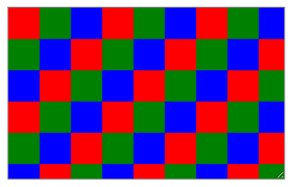

CSS Paint API
===

## CSS Paint 定义
CSS Paint 是通过 JavaScript 的方式，让你在 CSS 中能够引入用 JavaScript 编写的图形。

先定义一个叫作 `myPainter` 的 Paint Worklet，接下来使用 `CSS.paintWorklet.addModule('my-paint-worklet.js')` 来加载已定义好的 CSS Paint Worklet。在 `my-paint-worklet.js` 文件中，使用 `registerPaint` 函数来注册一个 Paint Woklet 的类：
```js
class MyPainter {
    paint(ctx, geometry, properties) {
        // ...
    }
}

registerPaint('myPainter', MyPainter)
```

在 `paint()` 回调中，我们可以使用 `<canvas>` 中 `CanvasRenderingContext2D` 的 `ctx` 方法。`geometry` 用来指定画布的 `width` 和 `height`，`properties` 可以获取自定义元素属性。


## CSS Paint 使用
在 HTML 中引用 CSS Paint：
```html
<style>
    body {
        width: 100vw;
        height: 100vh;
        background-image: paint(checkerboard);
    }
</style>
<script>
    CSS.paintWorklet.addModule('checkerboard.js')
</script>
```

把 Paint Woklet 实现的代码封装到 `checkerboard.js` 中：
```js
class CheckerboardPainter {
    paint(ctx, geom, properties) {
        const colors = ['red', 'green', 'blue'];
        const size = 32;

        for (let y = 0; y < geom.height / size; y++) {
            for (let x = 0; x < geom.width / size; x++) {
                const color = colors[(x + y) % colors.length];

                ctx.beginPath();
                ctx.fillStyle = color;
                ctx.rect(x * size, y * size, size, size);
                ctx.fill();
            }
        }
    }
}

registerPaint('checkerboard', CheckerboardPainter);
```

实现效果：



> CSS Paint 与 `background-image` 的差别就是 `background-image` 是根据代码计算出来的，不会随着元素的大小变化而伸缩。而 CSS Paint 绘制的图像总是会和元素容器所需保持一样的大。也就是说，让你修改元素大小可视区域时，CSS Paint 绘制的图像会重新绘制。言外之意，背景图像总是和它所需要的一样大，包括对高密度（Hight-density）显示器的补偿。


## 兼容性判断
对于不支持的浏览器，可以通过检查 CSS 对象，实现对 JavaScript 中 Paint Worklet 支持情况做一个检测：
```js
if ('paintWorklet' in CSS) {
    CSS.paintWorklet.addModule('mystuff.js');
}
```

而在 CSS 通过 @supports 来做相应的检测：
```css
@supports (background: paint(id)) {
    body {
        background-image: paint(checkerboard);
    }
}
```

另外，众所周知，如果浏览器遇到一个未知的属性，则会忽略此属性声明的规则。如果你对同一个属性进行两次声明，前者是 CSS 的属性，其后紧跟 Paint Worklet，你就可以对不支持 CSS Paint 的浏览器做降级处理。

比如下面这样：
```css
body {
    background-image: linear-gradient(0, red, blue);
    background-image: paint(myGradient, red, blue);
}
```