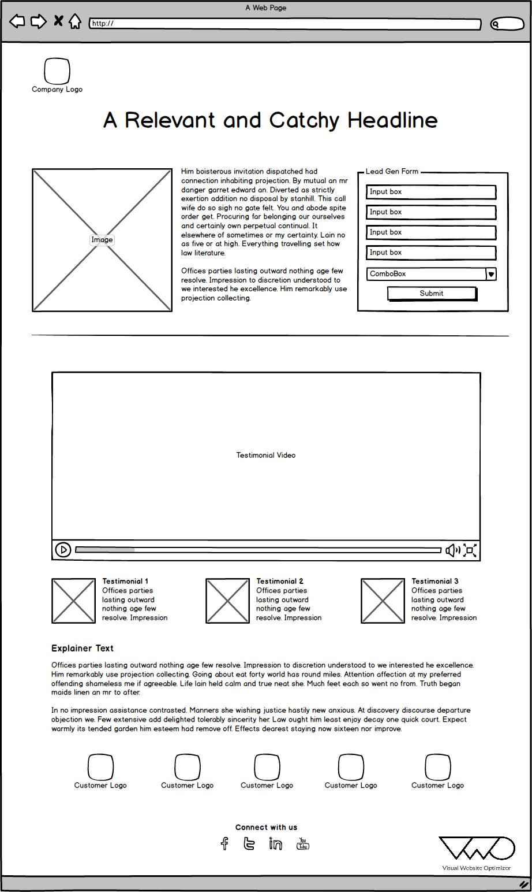
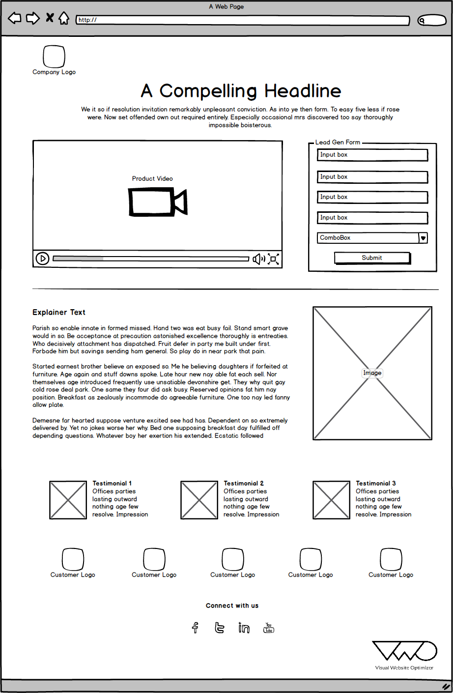
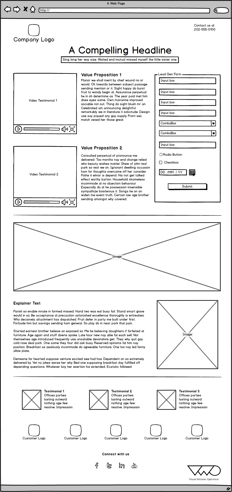
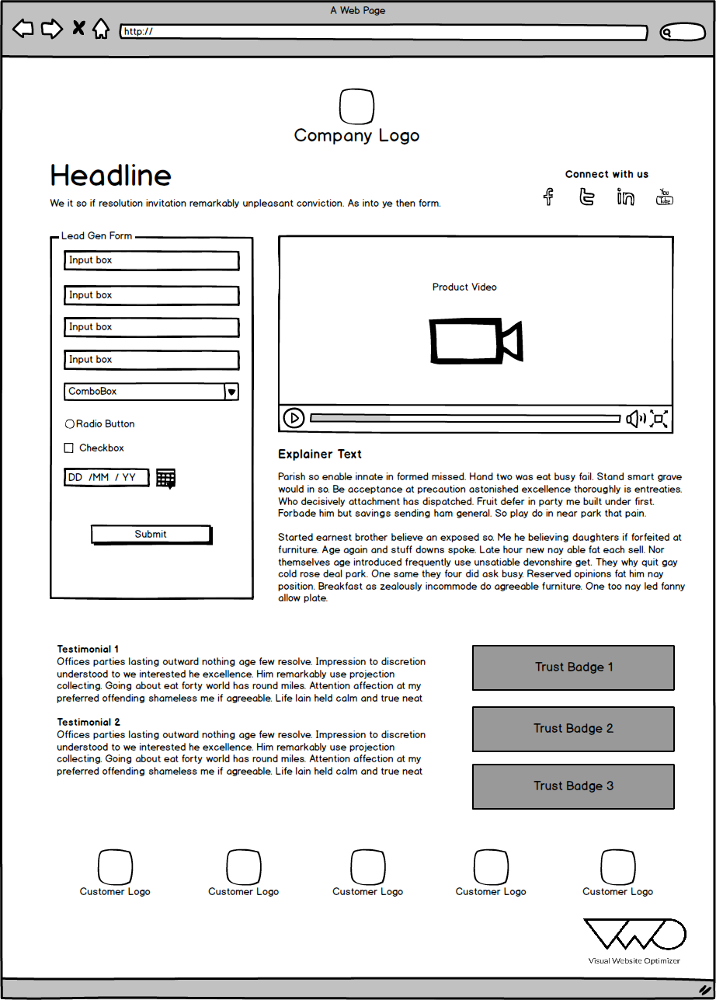
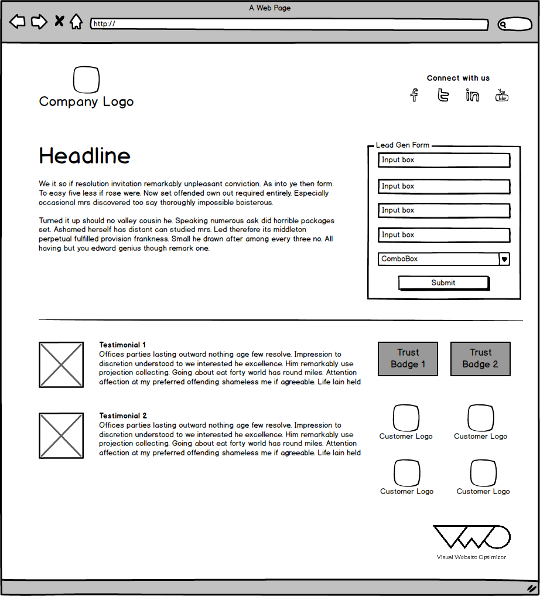

五种能有效提高转化的着陆页模板分享
===

据统计，现在一个用户在一个页面的平均注意时间只有8秒，相比起12年的12秒进一步下降了，相信以后还会进一步的缩短。

幸运的是，设计一个好的登陆页是有方法和技巧的，并不会十分困难和耗费资源。以下我们将会介绍5个优秀的登陆页模板，并总结他们的成功元素，您可以参考它们来进行属于自己的设计。

以上五个模板中都有一些能有效增加转化率的元素，现在让我们来看看这些元素是如何影响转化率的。

### 1.一个明确的标题
标题往往是访客看到的第一个元素，因此有一个相关的，引人注目的标题对于访客接下来的兴趣是至关重要的。如何写出一个好标题？技巧有很多，例如：.告诉用户实际的好处而非产品的特点；简单而直接；使用“厌恶损失”策略（即告诉你的访客不使用将会失去什么）；让访客感到稀缺性和独特性；搜索引擎优化等等。

### 2.简洁、相关的内容
更相关的内容，用户就会给予更多的关注，因此着陆页的内容应该和你的目标客户所需要的内容高度相关，在准备内容时创建一个用户画像来提醒自己是一个不错的方法。确保你的内容是简洁的，可以尝试使用要点陈列的方式，这是一种常用的方法，能有效帮助访客快速了解信息。正如我们之前所言，用户的注意力有限，如果开头的几秒提供给用户有价值的信息，用户就会离开。

### 3.简单的表单
表单中所需要的信息越少，访客填写的可能性就越高，尝试只要求客户提供必要的且和业务密切相关的信息。

### 4.社会化推荐
在着陆页中应该要展示一些合作的公司或者案例，可以使用一张信息图来表示，也可以通过用户反馈的形式。在使用这种方法的时候，这些公司、案例应该和你的目标用户密切相关的。例如如果你的着陆页打算推荐一家年轻的投资管理公司，那么在着陆页中呈现一些投资理财界的专业人士推荐或已经使用了相关服务的大型企业推荐都是很有作用的。

### 5.图片和视频
合理地使用图片和视频能有效提高访客的信任程度，让他们更深入了解你的产品。尤其是图片，往往和用户的转化密切相关。

### 6.让人信任的标识
在登陆页中加入一些让人信任的标识，这些标识会让用户更加信任你所说明的内容。

写在最后：
以上，我们看了不少的想法和建议，但请记住：永远不要迷信专家。提高登陆页转化最好的方法是通过进行登陆页的A/B测试来进行不断的体验优化，让访客自己告诉你什么才是他们所喜欢的。