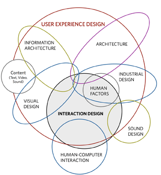
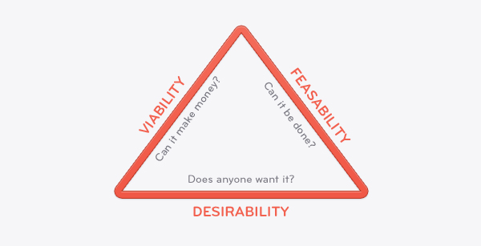
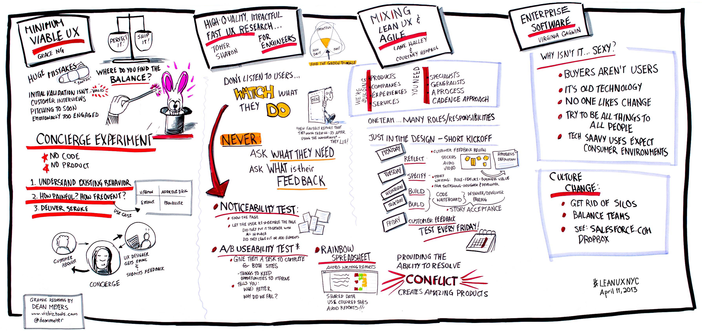

用户体验设计和精益设计的平衡之道
===

对你而言那个更重要：是制作出拥有杀手级用户体验的产品来吸引用户？还是尽快制作出能满足用户的产品并抢占大量的市场份额？

如果一款产品用户体验很差的话，用户不会使用它，但如果作为市场上的先入者，用户也会乐意试用而且反馈有用的意见来完善它。人们一直努力在平衡体验和时间这种对立问题，所以我们认为，应该用一个更好的框架去思考这个问题：体验设计还是精益设计，应该取决于公司（或者产品）所处的阶段。当然这仅仅是是一个框架，一切还是需要结合自己实际的情况，如果你认为完全参照这篇文章就可以成功把产品推向市场，很遗憾，这是不能的。

## 哪个优先级更高：体验和执行
### 体验
好的产品都有一些共同的特点：优秀的用户体验。好的产品不仅满足人们的需求，而且还会给他们带来额外的惊喜，它们会给用户最清晰的导航和最简洁的流程，用户能简单、直观地使用。

当然这些都是理论上的，事实上很少有产品的体验能达到这种完美的程度。我们会经常讨论产品的UI、优先功能、流程和导航、框架、原型等等。用户体验是用户如何使用产品、用户如何感知产品，用户如何看待产品。用户体验的定义是如此的广泛，下图是它一个基本的框架。

### 执行
而另外一种设计方式则被称为精益设计，也就是所谓的最小可行产品（MVP）.精益设计的一个核心思路是推出能基本满足功能的产品，迅速抢占市场，通过用户反馈进行快速迭代。
不少精益设计支持者都认为这种方法能真正得到用户的意见反馈，从而真正满足用户的需求。他们普遍认为：在你没有真正的用户之前，你不可能理解用户真正的需要。得到基本知识并进行必须的沟通，然后通过用户真正的行为来寻求用户真正的需求。通过一些小型的测试，并不能真正抓到用户的需求，你只是在希望控制你的用户。大部分用户总是喜欢尝试新品，而放弃目前的潮流。

## 现在让我们回到产品本身，任何一款产品都需要考虑以下三个问题：

### 商业性
尽管精益设计有不少成功例子，例如Dropbox用了4年就成为一个估值10亿产品。但精益设计往往也意味着最小可行的商业性（MVB），这可能会导致收入和流量增长较慢。当然很多时候产品价值都需要一段长期的积累，事实上产品商业价值像火箭式增长是非常罕见的。但无论是缓慢增长还是火箭式增长，真正重要的事请是：这个产品能否盈利。

### 可实现性
商业性只是产品的一部分，接下来我们需要评估我们的资源、资金、技术能否支持这个产品的实现。但往往有很多人都会忽略这个问题，但实际上不解决这个问题产品就无法继续发展。

### 3. 被需求性
最后，产品是必须能满足用户某种需求的，这样产品才能具有最起码的价值（MDP）。

Aarron Walter（情感化设计的作者)认为哪怕是在精益设计中，用户体验同样是被需求性的关键：“在一开始，产品的重点在于易学性和易用性，但一段时间后，当市场出现了大量的产品，什么才能让你的产品脱颖而出？答案是个性化，功能特性都可以后续增加，但首选你的产品必须具有独特的个性。

下面将是针对产品各个阶段应该如何处理精益设计和用户体验的提出一些建议，产品所在的阶段决定了对用户体验或精益设计的权重。
设计是路径依赖的，也就是说前期的草图可能就限制了以后的发展，除非你能放弃一切重新开始。但这种做法往往都是不可取的，更可能的是，你会选择把新的内容融合到原有的设计当中。所以尽快降低一个产品的不确定性有助于创造一个成功的产品。

这意味着花费有限的资源去专注解决一个真正的需求是一种合适的策略。简单的设计，合理的功能，正确的发展方向。把功能优化、体验完美的这些作为下一个阶段的核心工作。Laura Klein认为：MVP（最小可行产品）不是产品糟糕的借口。MVP应该是能不断学习，不断优化的，但从一个糟糕的产品当中，除了人们不喜欢糟糕的产品这一点外，你不会学到其他。

一般来说产品会有三个主要市场阶段：
### 1. 技术阶段——一点用户体验+大量的精益设计
* 目标：组建团队并了解市场的需求

* 关键因素：关注最小可用产品，重点在于产品的可行性（包括商业上和技术上的）。你不能关注用户体验，因为你还没有用户。你知道谁可能使用，但不知道谁会使用。尽可能得出一个产品原型，并从这个原型中得出谁需要它，谁使用它，如何使用它。

* 成功标准：测试组之外的用户想用它

### 2. 功能阶段——有限的用户体验+较少的精益设计
* 目标：基于现有或预期的用户需求，解决最重要的功能问题

* 关键因素：从用户的决策和情感中开始塑造用户体验，你希望用户对你的产品有信心？还是希望他们好奇？同时密切关注竞争对手的功能更新。不要奢望在产品提供正确的功能和体验之前能得到什么东西。

* 成功标准：用户表达他们对产品的使用体验和感受。

### 3. 体验阶段——尽可能优化用户体验+不采用精益设计
* 目标：研究用户在使用产品时究竟在干什么
* 关键因素：不增加非必要的功能，找寻出用户真正的痛点所在，思考怎么才能留住客户。研究世界各地的用户体验设计，并应用这些知识。努力打造出一款真正符合用户体验设计的产品。
* 成功标准：用户中形成口碑和病毒营销

## 用户体验设计VS精益设计
事实上，这两种设计方法并非完全的对立，他们最核心的地方是一致的：以用户为中心的设计。越早越好地满足用户的需求，产品就能成功。用户不在乎你如何打造产品，也不在乎你付出了多少，他们需要一个好用的产品。下面通过模拟设计一款新应用来简单介绍两种方法

### 用户体验设计：
1. 明确用户、问题、项目：人们需要一个把一周食谱变成购物清单的应用
2. 分析用户和竞争对手：建立用户角色和经验地图，并进行竞品分析，找出购物APP的市场和用户痛点，
3. 设计：根据之前的资料制作草图、线框图、低保真原型，然后不断提升用户体验，最终打造出一个高保真原型。
4. 寻找使用者：找出使用的核心人群并进行测试，这往往是一个被低估的步骤，这很可能会导致产品的失败。理论情况下，这类测试应该在每个阶段都进行。

### 精益设计
1. 观察和头脑风暴：观察用户购物内容和他们制作菜式之间的关系，关注能改变购物体验的地方
2. 最小可行产品：从测试用户当中获得反馈，设计一个可以把菜单转换为购物清单的应用。
3. 收集反馈与迭代：也许购物清单并非用户真正痛点，用户需求的是简单便利地寻找到合适的食谱。寻找出用户关键的需求，并从这里开始入手。

### 精益式的用户体验是对两种方法融合的尝试。
第一个关键点在于在产品各个阶段，甚至是我们希望尽快推出产品时都把用户体验当成目标。这样，随着用户体验重要性的确立，设计将变得越来越人性化

第二个关键点在于收集更多来自用户的反馈。当然这并不意味着要取悦所有用户，时间、资金、团队管理和用户一样，都是需要重要考虑的因素。

