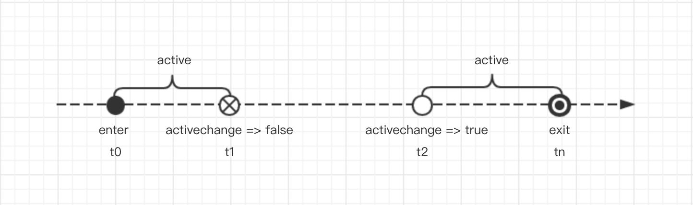
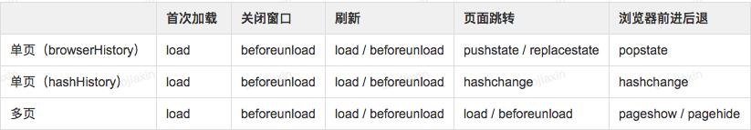
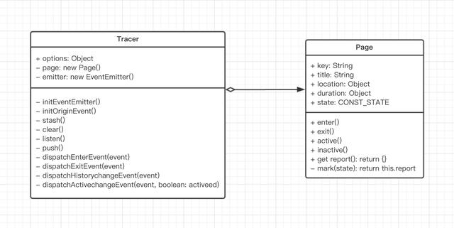
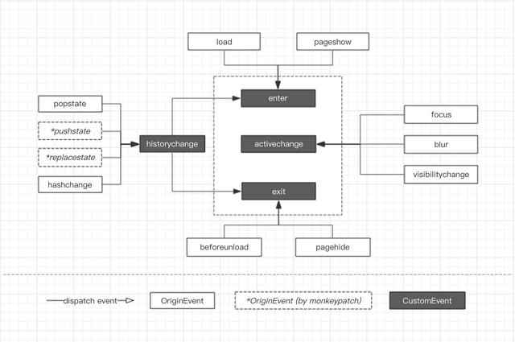

如何精确统计页面停留时长
===

## 1.背景
页面停留时间（Time on Page）简称 Tp，是网站分析中很常见的一个指标，用于反映用户在某些页面上停留时间的长短，传统的 Tp 统计方法会存在一定的统计盲区，比如无法监控单页应用，没有考虑用户切换 Tab、最小化窗口等操作场景。基于上述背景，重新调研和实现了精确统计页面停留时长的方案，需要兼容单页应用和多页应用，并且不耦合或入侵业务代码。

## 2.分析
我们可以把一个页面生命周期抽象为三个动作：「进入」、「活跃状态切换」、「离开」

如下图，计算页面停留时长既如何监控这三个动作，然后在对应触发的事件中记录时间戳，比如要统计活跃停留时长就把 active 区间相加即可，要统计总时长既 tn -t0 。



2.1 如何监听页面的进入和离开？

对于常规页面的 **首次加载、页面关闭、刷新** 等操作都可以通过 `window.onload` 和 `window.onbeforeunload` 事件来监听页面进入和离开，浏览器前进后退可以通过 `pageshow` 和 `pagehide` 处理。

对于单页应用内部的跳转可以转化为两个问题：**1.监听路由变化，2.判断变化的 URL 是否为不同页面**。

2.1.1 监听路由变化

目前主流的单页应用大部分都是基于 browserHistory (history api) 或者 hashHistory 来做路由处理，我们可以通过监听路由变化来判断页面是否有可能切换。注意是有可能切换，因为 URL 发生变化不代表页面一定切换，具体的路由配置是由业务决定的（既 URL 和页面的匹配规则）。

browserHistory

路由的变化本质都会调用 History.pushState() 或 History.replaceState() ，能监听到这两个事件就能知道。通过 popstate 事件能解决一半问题，因为 popstate 只会在浏览器前进后退的时候触发，当调用 history.pushState() or history.replaceState() 的时候并不会触发。

这里需要通过猴子补丁(Monkeypatch)解决，运行时重写 history.pushState 和 history.replaceState 方法：

```js
let _wr = function (type) {
    let orig = window.history[type];

    return function () {
        let rv = orig.apply(this, arguments);
        let e = new Event(type.toLowerCase());

        e.arguments = arguments;

        window.dispatchEvent(e);

        return rv;
    }
}

window.history.pushState = _wr('pushState');
window.history.replaceState = _wr('replaceState');
window.addEventListener('pushstate', function (event) {});
window.addEventListener('replacestate', function (event) {});
```

hashHistory

hashHistory 的实现是基于 hash 的变化，hash 的变化可以通过 hashchange 来监听

2.1.2 判断URL是否为不同页面

问题本质是怎么定义一个页面，这里我们无法自动获取，因为不同业务场景定义不同，需要业务方在初始化的时候配置 rules 参数，默认不传入 rules 的情况取 location.pathname 为 key，key 不相同则判断为不同的页面，配置的语法：

```js
new Tracer({
    rules: [{
        path: '/index',
    }, {
        path: '/detail/:id',
    }, {
        path: '/user',
        query: {
            tab: 'profile',
        },
    }],
);
```

对于页面进入和离开相关事件整理



2.2 如何监听页面活跃状态切换？

可以通过 Page Visibility API 以及在 window 上声明 onblur/onfocus 事件来处理。

2.2.1 Page Visibility API

一个网页的可见状态可以通过 Page Visibility API 获取，比如当用户 切换浏览器Tab、最小化窗口、电脑睡眠 的时候，系统API会派发一个当前页面可见状态变化的 visibilitychange 事件，然后在事件绑定函数中通过 document.hidden 或者 document.visibilityState 读取当前状态。

```js
document.addEventListener('visibilitychange', function (event) {
    console.log(document.hidden, document.visibilityState);
});
```

2.2.2 onblur/onfocus

2.3 什么时机上报数据？

2.3.1 页面离开时上报

对于页面刷新或者关闭窗口触发的操作可能会造成数据丢失

2.3.2 下次打开页面时上报

会丢失历史访问记录中的最后一个页面数据

目前采用的方案2，对于单页内部跳转是即时上报，对于单页/多页应用触发 window.onbeforeunload 事件的时候会把当前页面数据暂存在 localStorage 中，当用户下次进入页面的时候会把暂存数据上报。有个细节问题，如果用户下次打开页面是在第二天，对于统计当天的活跃时长会有一定的误差，所以在数据上报的同时会把该条数据的页面进入时间/离开时间带上。

3.设计
3.1 UML类关系图

Tracer

核心类，用来实例化一个监控，对原生事件和自定义事件的封装，监听 enter activechange exit 事件来操作当前 Page 实例。

P.S. 取名来自暴雪旗下游戏守望先锋英雄猎空(Tracer)，直译为：追踪者。

Page

页面的抽象类，用来实例化一个页面，封装了 enter exit active inactive 等操作，内部通过 state 属性来维护当前页面状态。



3.2 事件派发关系图



4.思考
对于页面停留时长的定义可能在不同场景会有差异，比如内部业务系统或者OA系统，产品可能更关心用户在页面的活跃时长；而对于资讯类型的产品，页面可见时长会更有价值。单一的数据对业务分析是有限的，所以在具体的代码实过程中我们会把停留时长分三个指标，这样能更好的帮助产品/运营分析。

active 页面活跃时长

visible 页面可见时长 //仅支持Desktop

duration 页面总停留时长

6.TODO
移动端的兼容性目前还没完全覆盖；

对于页面的配置目前还不够灵活，考虑支持 react-router / vue-router 的配置；

byted-cg-tracer 待封装；开发中

7.参考
https://developer.mozilla.org/en-US/docs/Web/API/WindowEventHandlers/onhashchange

https://developer.mozilla.org/en-US/docs/Web/Events/popstate

https://developer.mozilla.org/en-US/docs/Web/API/Page_Visibility_API

https://stackoverflow.com/questions/4570093/how-to-get-notified-about-changes-of-the-history-via-history-pushstate
