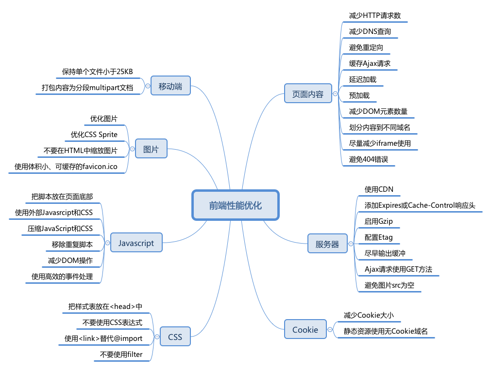

前端性能优化
===



前端性能的一个重要指标是页面加载时间，不仅事关用户体验，也是搜索引擎排名考虑的一个因素。

* 来自Google的数据表明，一个有10条数据0.4秒能加载完的页面，变成30条数据0.9秒加载完之后，流量和广告收入下降90%。
* Google Map 首页文件大小从100KB减小到70-80KB后，流量在第一周涨了10%，接下来的三周涨了25%。
* 亚马逊的数据表明：加载时间增加100毫秒，销量就下降1%。

以上数据更说明「加载时间就是金钱」，前端优化主要围绕提高加载速度进行。

## 一、页面内容
### （1）减少HTTP请求数
Web 前端 80% 的响应时间花在图片、样式、脚本等资源下载上。最直接的方式是减少页面所需资源，但并不现实。所以，减少 HTTP 请求数主要的途径是：

> 合并 JS/CSS 文件。服务器端（CDN）自动合并，基于 Node.js 的文件合并工具，通过把所有脚本放在一个文件中的方式来减少请求数。

> 使用CSS Sprite将背景图片合并成一个文件，通过 `background-image` 和 `background-position` 控制显示

> 行内图片（Base64 编码）。使用 Data URI scheme 将图片嵌入 HTML 或者 CSS 中；或者将 CSS、JS、图片直接嵌入 HTML 中，会增加文件大小，也可能产生浏览器兼容及其他性能问题。

减少页面的 HTTP 请求数是个起点，这是提升站点首次访问速度的重要指导原则。

### （2）减少DNS查询
用户输入 URL 以后，浏览器首先要查询域名（hostname）对应服务器的 IP 地址，一般需要耗费 20-120 毫秒时间。DNS 查询完成之前，浏览器无法从服务器下载任何数据。

基于性能考虑，ISP、局域网、操作系统、浏览器都会有相应的 DNS 缓存机制。

* IE 缓存 30 分钟，可以通过注册表中 DnsCacheTimeout 项设置；
* Firefox 缓存 1 分钟，通过 network.dnsCacheExpiration 配置；

另外减少不同的主机名可减少 DNS 查找，减少不同主机名的数量同时也减少了页面能够并行下载的组件数量，避免 DNS 查找削减了响应时间，而减少并行下载数量却增加了响应时间。原则是把组件分散在 2 到 4 个主机名下，这是同时减少 DNS 查找和允许高并发下载的折中方案。

### （3）避免重定向
HTTP 重定向通过 301/302 状态码实现。下面是一个有 301 状态码的 HTTP 头
```bash
HTTP/1.1 301 Moved Permanently
Location: http://example.com/newuri
Content-Type: text/html
```

浏览器会自动跳转到 Location 域指明的 URL。重定向需要的所有信息都在 HTTP 头部，而响应体一般是空的。其实额外的 HTTP 头，比如 Expires 和 Cache-Control 也表示重定向。除此之外还有别的跳转方式：refresh 元标签和 JavaScript，但如果你必须得做重定向，最好用标准的 3xxHTTP 状态码，主要是为了让返回按钮能正常使用。

客户端收到服务器的重定向响应后，会根据响应头中 Location 的地址再次发送请求。重定向会影响用户体验，尤其是多次重定向时，用户在一段时间内看不到任何内容，只看到浏览器进度条一直在刷新。

* 最浪费的重定向经常发生、而且很容易被忽略：URL 末尾应该添加/但未添加。比如，访问 `http://astrology.yahoo.com/astrology` 将被 301 重定向到 `http://astrology.yahoo.com/astrology/`（注意末尾的 /）。如果使用 Apache，可以通过 Alias 或 mod_rewrite 或 DirectorySlash 解决这个问题。
* 网站域名变更：CNAME 结合 Alias 或 mod_rewrite 或者其他服务器类似功能实现跳转。

### （4）缓存 Ajax 请求
最重要的的优化方式是缓存响应结果。有尚未过期的 Expires 或者 Cache-Control HTTP 头，那么之前的资源就可以从缓存中读出。必须通知浏览器，应该继续使用之前缓存的资源响应，还是去请求一个新的。可以通过给资源的 Ajax URL 里添加一个表明用户资源最后修改时间的时间戳来实现。如果资源从上一次下载之后再没有被修改过，时间戳不变，资源就将从浏览器缓存中直接读出，从而避免一次额外的 HTTP 往返消耗。

### （5）延迟加载
页面初始加载时哪些内容是绝对必需的？不在答案之列的资源都可以延迟加载。比如：

* 非首屏使用的数据、样式、脚本、图片等；
* 用户交互时才会显示的内容。

遵循「渐进增强」理念开发的网站：JavaScript 用于增强用用户体验，但没有（不支持） JavaScript 也能正常工作，完全可以延迟加载 JavaScript。

> 将首屏以外的 HTML 放在不渲染的元素中，如隐藏的 `<textarea>`，或者 type 属性为非执行脚本的 `<script>` 标签中，减少初始渲染的 DOM 元素数量，提高速度。等首屏加载完成或者用户操作时，再去渲染剩余的页面内容。

### （6）预加载
预先加载利用浏览器空闲时间请求将来要使用的资源，以便用户访问下一页面时更快地响应。

* 无条件预先加载：页面加载完成（load）后，马上获取其他资源。以 google.com 为例，首页加载完成后会立即下载一个 Sprite 图片，此图首页不需要，但是搜索结果页要用到。
* 有条件预先加载：根据用户行为预判用户去向，预载相关资源。比如 search.yahoo.com 开始输入时会有额外的资源加载。Chrome 等浏览器的地址栏也有类似的机制。
* 有「阴谋」的预先加载：页面即将上线新版前预先加载新版内容。网站改版后由于缓存、使用习惯等原因，会有旧版的网站更快更流畅的反馈。为缓解这一问题，在新版上线之前，旧版可以利用空闲提前加载一些新版的资源缓存到客户端，以便新版正式上线后更快的载入。

### （7）减少DOM元素数量
复杂的页面不仅下载的字节更多，JavaScript DOM 操作也更慢。例如，同是添加一个事件处理器，500 个元素和 5000 个元素的页面速度上会有很大区别。

从以下几个角度考虑移除不必要的标记：

* 是否还在使用表格布局？
* 塞进去更多的 `<div>` 仅为了处理布局问题？也许有更好、更语义化的标记。
* 能通过伪元素实现的功能，就没必要添加额外元素，如清除浮动。

浏览器控制台中输入以下代码可以计算出页面中有多少 DOM 元素：

```js
document.getElementsByTagName('*').length;
```

为什么不使用表格布局？

* 更多的标签，增加文件大小；
* 不易维护，无法适应响应式设计；
* 性能考量，默认的表格布局算法会产生大量重绘

### （8）划分内容到不同域名
浏览器一般会限制每个域的并行线程（一般为 6 个，甚至更少），使用不同的域名可以最大化下载线程，但注意保持在 2-4 个域名内，以避免 DNS 查询损耗。

例如，动态内容放在 csspod.com 上，静态资源放在 static.csspod.com 上。这样还可以禁用静态资源域下的 Cookie，减少数据传输，详见 Cookie 优化。

### （9）尽量减少 iframe 的使用
用 iframe 可以把一个 HTML 文档插入到父文档里，重要的是明白 iframe 是如何工作的并高效地使用它。

`<iframe>` 的优点：

* 可以用来加载速度较慢的第三方资源，如广告、徽章；
* 可用作安全沙箱；
* 可以并行下载脚本。

`<iframe>` 的缺点：

* 加载代价昂贵，即使是空的页面；
* 阻塞页面 load 事件触发；

> Iframe 完全加载以后，父页面才会触发 load 事件。 Safari、Chrome 中通过 JavaScript 动态设置 iframe src 可以避免这个问题。

缺乏语义。

### （10）避免 404 错误
HTTP 请求很昂贵，返回无效的响应（如 404 未找到）完全没必要，降低用户体验而且毫无益处。

一些网站设计很酷炫、有提示信息的 404 页面，有助于提高用户体验，但还是浪费服务器资源。尤其糟糕的是外部脚本返回 404，不仅阻塞其他资源下载，浏览器还会尝试把 404 页面内容当作 JavaScript 解析，消耗更多资源。


## 二、服务器
### （1）使用 CDN
用户与服务器的物理距离对响应时间也有影响。把内容部署在多个地理位置分散的服务器上能让用户更快地载入页面。但具体要怎么做呢？

网站 80-90% 响应时间消耗在资源下载上，减少资源下载时间是性能优化的黄金法则。相比分布式架构的复杂和巨大投入，静态内容分发网络（CDN）可以以较低的投入，获得加载速度有效提升。

内容分发网络（CDN）是一组分散在不同地理位置的 web 服务器，用来给用户更高效地发送内容。典型地，选择用来发送内容的服务器是基于网络距离的衡量标准的。例如：选跳数（hop）最少的或者响应时间最快的服务器。

### （2）添加Expires或Cache-Control响应头
* 静态内容：将 Expires 响应头设置为将来很远的时间，实现「永不过期」策略；
* 动态内容：设置合适的 Cache-Control 响应头，让浏览器有条件地发起请求。

Cache-Control 头在 HTTP/1.1 规范中定义，取代了之前用来定义响应缓存策略的头（例如 Expires、Pragma）。当前的所有浏览器都支持 Cache-Control，因此，使用它就够了。

### （3）启用Gzip
前端工程师可以想办法明显地缩短通过网络传输 HTTP 请求和响应的时间。毫无疑问，终端用户的带宽速度，网络服务商，对等交换点的距离等等，都是开发团队所无法控制的。但还有别的能够影响响应时间的因素，压缩可以通过减少 HTTP 响应的大小来缩短响应时间。

Gzip 压缩通常可以减少 70% 的响应大小，对某些文件更可能高达 90%，比 Deflate 更高效。主流 Web 服务器都有相应模块，而且绝大多数浏览器支持 gzip 解码。所以，应该对 HTML、CSS、JS、XML、JSON 等文本类型的内容启用压缩。

> **注意!!!** 图片和 PDF 文件不要使用 gzip。它们本身已经压缩过，再使用 gzip 压缩不仅浪费 CPU 资源，而且还可能增加文件体积。

从 HTTP/1.1 开始，**web 客户端** 就有了支持压缩的 Accept-Encoding HTTP 请求头。

> Accept-Encoding: gzip, deflate

如果 web 服务器看到这个请求头，它就会用客户端列出的一种方式来压缩响应。**web 服务器** 通过 Content-Encoding 响应头来通知客户端。

> Content-Encoding: gzip

### （4）配置 Etag
实体标签（ETags），是服务器和浏览器用来决定浏览器缓存中组件与源服务器中的组件是否匹配的一种机制（“实体”也就是组件：图片，脚本，样式表等等）。添加 ETags 可以提供一种实体验证机制，比最后修改日期更加灵活。一个 ETag 是一个字符串，作为一个组件某一具体版本的唯一标识符。唯一的格式约束是字符串必须用引号括起来，源服务器用相应头中的 ETag 来指定组件的 ETag。
```bash
HTTP/1.1 200 OK
      Last-Modified: Tue, 12 Dec 2006 03:03:59 GMT
      ETag: "10c24bc-4ab-457e1c1f"
      Content-Length: 12195
```

然后，如果浏览器必须验证一个组件，它用 If-None-Match 请求头来把 ETag 传回源服务器。如果 ETags 匹配成功，会返回一个 304 状态码，这样就减少了 12195 个字节的响应体。Etag 通过文件版本标识，方便服务器判断请求的内容是否有更新，如果没有就响应 304，避免重新下载。
```bash
GET /i/yahoo.gif HTTP/1.1
      Host: us.yimg.com
      If-Modified-Since: Tue, 12 Dec 2006 03:03:59 GMT
      If-None-Match: "10c24bc-4ab-457e1c1f"
      HTTP/1.1 304 Not Modified
```

### （5）尽早输出（flush）缓冲
用户请求页面时，服务器通常需要花费 200 ~ 500 毫秒来组合 HTML 页面。在此期间，浏览器处于空闲、等待数据状态。使用 PHP 中的 flush() 函数，可以发送部分已经准备好的 HTML 到浏览器，以便服务器还在忙于处理剩余页面时，浏览器可以提前开始获取资源。

可以考虑在 `</head>` 之后输出一次缓冲，HTML head 一般比较容易生成，先发送以便浏览器开始获取 `<head>` 里引用的 CSS 等资源。
```bash
Example:
<!-- css, js -->
</head>
<?php flush(); ?>
<body>
<!-- content -->
```

### （6）Ajax 请求使用 GET 方法
浏览器执行 XMLHttpRequest POST 请求时分成两步，先发送 Http Header，再发送 data。而 GET 只使用一个 TCP 数据包（Http Header 与 data）发送数据，所以首选 GET 方法。

根据 HTTP 规范，GET 用于获取数据，POST 则用于向服务器发送数据，所以 Ajax 请求数据时使用 GET 更符合规范。

### （7）避免图片 src 为空
图片 src 属性值为空字符串可能以下面两种形式出现：

HTML:
```html

```

JavaScript：
```js
var img = new Image();
img.src = "";
```

虽然 src 属性为空字符串，但浏览器仍然会向服务器发起一个 HTTP 请求：

* IE 向页面所在的目录发送请求；
* Safari、Chrome、Firefox 向页面本身发送请求；
* Opera 不执行任何操作。

空 src 产生请求的后果不容小觑：

* 给服务器造成意外的流量负担，尤其时日 PV 较大时；
* 浪费服务器计算资源；
* 可能产生报错。

空的 href 属性也存在类似问题。用户点击空链接时，浏览器也会向服务器发送 HTTP 请求，可以通过 JavaScript 阻止空链接的默认的行为。


## 三、Cookie
### （1）减少 Cookie 大小
Cookie 被用于身份认证、个性化设置等诸多用途。Cookie 通过 HTTP 头在服务器和浏览器间来回传送，减少 Cookie 大小可以降低其对响应速度的影响。

* 去除不必要的 Cookie；
* 尽量压缩 Cookie 大小；
* 注意设置 Cookie 的 domain 级别，如无必要，不要影响到 sub-domain；
* 设置合适的过期时间。

### （2）静态资源使用无 Cookie 域名
静态资源一般无需使用 Cookie，可以把它们放在使用二级域名或者专门域名的无 Cookie 服务器上，降低 Cookie 传送的造成的流量浪费，提高响应速度。


## 四、CSS
### （1）把样式表放在 `<head>` 中
把样式表放在 `<head>` 中可以让页面渐进渲染，尽早呈现视觉反馈，给用户加载速度很快的感觉。

这对内容比较多的页面尤为重要，用户可以先查看已经下载渲染的内容，而不是盯着白屏等待。

如果把样式表放在页面底部，一些浏览器为减少重绘，会在 CSS 加载完成以后才渲染页面，用户只能对着白屏干瞪眼，用户体验极差。把样式表放到文档的 HEAD部分能让页面看起来加载地更快。

### （2）不要使用 CSS 表达式
CSS 表达式可以在 CSS 里执行 JavaScript，仅 IE5-IE7 支持，IE8 标准模式已经废弃。
CSS 表达式超出预期的频繁执行，页面滚动、鼠标移动时都会不断执行，带来很大的性能损耗。

### （3）使用 `<link>` 替代 @import
对于 IE 某些版本，`@import` 的行为和放在页面底部一样。所以，不要用它。

### （4）不要使用 filter
AlphaImageLoader 为 IE5.5-IE8 专有的技术，和 CSS 表达式一样，放进博物馆吧。IE 专有的 AlphaImageLoader 滤镜可以用来修复 IE7 之前的版本中半透明 PNG 图片的问题。在图片加载过程中，这个滤镜会阻塞渲染，卡住浏览器，还会增加内存消耗而且是被应用到每个元素的，而不是每个图片，所以会存在一大堆问题。

> **注意！！！** 这里所说的不是 CSS3 Filter


## 五、Javasript
### （1）把脚本放在页面底部
浏览器下载脚本时，会阻塞其他资源并行下载，即使是来自不同域名的资源。因此，最好将脚本放在底部，以提高页面加载速度。
一些特殊场景无法将脚本放到页面底部的，可以考虑 `<script>` 的以下属性：

* defer 属性；
* HTML5 新增的 async 属性。

### （2）使用外部 JavaScript 和 CSS
外部 JavaScript 和 CSS 文件可以被浏览器缓存，在不同页面间重用，也能降低页面大小。

当然，实际中也需要考虑代码的重用程度。如果仅仅是某个页面使用到的代码，可以考虑内嵌在页面中，减少 HTTP 请求数。另外，可以在首页加载完成以后，预先加载子页面的资源。

### （3）压缩 JavaScript 和 CSS
压缩代码可以移除非功能性的字符（注释、空格、空行等），减少文件大小，提高载入速度。

> 得益于 Node.js 的流行，开源社区涌现出许多高效、易用的前端优化工具，JavaScript 和 CSS 压缩类的，不敢说多如牛毛，多入鸡毛倒是一点不夸张，如[UglifyJS 2](https://github.com/mishoo/UglifyJS2)、csso、cssnano 等。

> 对于内嵌的 CSS 和 JavaScript，也可以通过 htmlmin 等工具压缩。

> 这些项目都有 Gulp、Webpack 等流行构建工具的配套版本。

### （4）移除重复脚本
重复的脚本不仅产生不必要的 HTTP 请求，而且重复解析执行浪费时间和计算资源。

### （5）减少DOM操作
JavaScript 操作 DOM 很慢，尤其是 DOM 节点很多时。

使用时应该注意：

* 缓存已经访问过的元素；
* 使用 DocumentFragment 暂存 DOM，整理好以后再插入 DOM 树；
* 操作 className，而不是多次读写 style；
* 避免使用 JavaScript 修复布局。

### （6）使用高效的事件处理

* 减少绑定事件监听的节点，如通过事件委托；
* 尽早处理事件，在 DOMContentLoaded 即可进行，不用等到 load 以后。


## 六、图片
### （1）优化图片
尝试把 GIF 格式转换成 PNG 格式，看看是否节省空间。在所有的 PNG 图片上运行 pngcrush（或者其它 PNG 优化工具）。

* [imagemin](https://link.juejin.im/?target=https%3A%2F%2Fgithub.com%2Fimagemin%2Fimagemin)
* [imageoptim.com](https://link.juejin.im/?target=https%3A%2F%2Fimageoptim.com%2Fmac)

### （2）优化 CSS Sprite

* 水平排列 Sprite 中的图片，垂直排列会增加图片大小；
* Spirite 中把颜色较近的组合在一起可以降低颜色数，理想状况是低于 256 色以适用 PNG8 格式；
* 不要在 Spirite 的图像中间留有较大空隙。减少空隙虽然不太影响文件大小，但可以降低用户代理把图片解压为像素图的内存消耗，对移动设备更友好。

### （3）不要在HTML中缩放图片
不要使用 `` 的 width、height 缩放图片，如果用到小图片，就使用相应大小的图片。如果需要
``
那么图片本身（mycat.jpg）应该是 100x100px 的，而不是去缩小 500x500px 的图片。

> 很多 CMS 和 CDN 都提供图片裁切功能。

补充：设置图片的宽和高，以免浏览器按照「猜」的宽高给图片保留的区域和实际宽高差异，产生重绘。

### （4）使用体积小、可缓存的 favicon.ico
Favicon.ico 一般存放在网站根目录下，无论是否在页面中设置，浏览器都会尝试请求这个文件。

所以确保这个图标：

* 存在（避免 404）；
* 尽量小，最好小于 1K；
* 设置较长的过期时间。

> 对于较新的浏览器，可以使用 PNG 格式的 favicon。

## 七、移动端
### （1）保证所有组件都小于 25K
这个限制是因为 iPhone 不能缓存大于 25K 的组件，注意这里指的是未压缩的大小。这就是为什么缩减内容本身也很重要，因为单纯的 gzip 可能不够。

### （2）打包内容为分段（multipart）文档
把各个组件打包成一个像有附件的电子邮件一样的复合文档里，可以用一个 HTTP 请求获取多个组件（记住一点：HTTP 请求是代价高昂的）。用这种方式的时候，要先检查用户代理是否支持（iPhone 就不支持）。


## 总结
写到这里，雅虎的 35 条军规算是介绍完了。条目虽然很多，但经过分类，可以发现，性能优化主要切入点可以从以下几个方面去考虑：

* 资源本身大小的压缩优化（想办法减少资源的体积）
* 网络请求的全过程（从 url 地址栏输入发送请求开始到返回响应包的每个环节）
* 浏览器渲染的全过程（拿到资源后浏览器渲染的每个环节）

因此，要彻底掌握优化的方法，必须对 http 请求的全过程以及浏览器的渲染全过程都有深入的理解。
