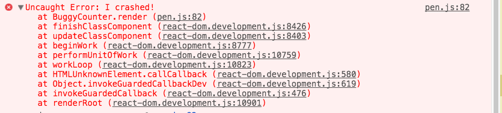

React 异常处理
===

在 React 0.15 版本及之前版本中，组件内的 UI 异常将中断组件内部状态，导致下一次渲染时触发隐藏异常。React 并未提供友好的异常捕获和处理方式，一旦发生异常，应用将不能很好的运行。而 React 16 版本有所改进。

我们期望的是在 UI 中发生的一些异常，即 **组件内异常**（指 React 组件内发生的异常，包括组件渲染异常，组件生命周期方法异常等），不会中断整个应用，可以以比较友好的方式处理异常，上报异常。在 React 16 版本以前是比较麻烦的，在 React 16 中提出了解决方案，将从异常边界（Error Boundaries）开始介绍。


## 异常边界
所谓异常边界，即是标记当前内部发生的异常能够被捕获的区域范围，在此边界内的 JavaScript 异常可以被捕获到，不会中断应用，这是 React 16 中提供的一种处理组件内异常的思路。具体实现而言，React 提供一种异常边界组件，以捕获并打印子组件树中的 JavaScript 异常，同时显示一个异常替补 UI。

### 组件内异常
组件内异常，也就是异常边界组件能够捕获的异常，主要包括：

1. 渲染过程中异常；
2. 生命周期方法中的异常；
3. 子组件树中各组件的 constructor 构造函数中异常。

### 其他异常
当然，异常边界组件依然存在一些无法捕获的异常，主要是异步及服务端触发异常：

1. 事件处理器中的异常；
2. 异步任务异常，如setTiemout，ajax请求异常等；
3. 服务端渲染异常；
4. 异常边界组件自身内的异常；


## 异常边界组件
前面提到异常边界组件只能捕获其子组件树发生的异常，不能捕获自身抛出的异常，所以有必要注意两点：

1. 不能将现有组件改造为边界组件，否则无法捕获现有组件异常；
2. 不能在边界组件内涉及业务逻辑，否则这里的业务逻辑异常无法捕获；

很显然，最终的异常边界组件必然是不涉及业务逻辑的独立中间组件。

那么一个异常边界组件如何捕获其子组件树异常呢？很简单，首先它也是一个 React 组件，然后添加 `ComponentDidCatch` 生命周期方法。

### 实例
创建一个 React 组件，然后添加 `ComponentDidCatch` 生命周期方法：
```js
class ErrorBoundary extends React.Component {
  constructor(props) {
    super(props);

    this.state = {
      hasError: false,
    };
  }

  componentDidCatch(error, info) {
    // Display fallback UI
    this.setState({
      hasError: true,
    });

    // You can also log the error to an error reporting service
    logErrorToMyService(error, info);
  }

  render() {
    if (this.state.hasError) {
      // You can render any custom fallback UI
      return <h1>Meet Some Errors.</h1>;
    }

    return this.props.children;
  }
}
```

接下来可以像使用普通 React 组件一样使用该组件：
```js
<ErrorBoundary>
  <App />
</ErrorBoundary>
```


## ComponentDidCatch
这是一个新的生命周期方法，使用它可以捕获子组件异常，其原理类似于 JavaScript 异常捕获器 `try, catch`。
```js
ComponentDidCatch(error, info)
```

1. error：应用抛出的异常；


2. info：异常信息，包含 `ComponentStack` 属性对应异常过程中冒泡的组件栈；


判断组件是否添加 `componentDidCatch` 生命周期方法，添加了，则调用包含异常处理的更新渲染组件方法：
```js
if (inst.componentDidCatch) {
  this._updateRenderedComponentWithErrorHandling(
    transaction,
    unmaskedContext,
  );
} else {
  this._updateRenderedComponent(transaction, unmaskedContext);
}
```


## 业务项目中的异常边界
前面提到的都是异常边界组件技术上可以捕获内部子组件异常，对于业务实际项目而言，还有需要思考的地方：

1. 异常边界组件的范围或粒度：是使用异常边界组件包裹应用根组件（粗粒度），还是只包裹独立模块入口组件（细粒度）；
2. 粗粒度使用异常边界组件是暴力处理异常，任何异常都将展示异常替补UI，完全中断了用户使用，但是确实能方便的捕获内部所有异常；
3. 细粒度使用异常边界组件就以更友好的方式处理异常，局部异常只会中断该模块的使用，应用其他部分依然正常不受影响，但是通常应用中模块数量是很多的，而且具体模块划分到哪一程度也需要开发者考量，比较细致；

[点此传送查看实例](https://codepen.io/gaearon/pen/wqvxGa?editors=0010)


## 组件外异常
React 16 提供的异常边界组件并不能捕获应用中的所有异常，而且 React 16 以后，所有未被异常边界捕获的异常都将导致 React 卸载整个应用组件树，所以通常需要通过一些其他前端异常处理方式进行异常捕获，处理和上报等，最常见的有两种方式：

1. `window.onerror` 捕获全局 JavaScript 异常；
```js
// 在应用入口组件内调用异常捕获
componentWillMount: function () {
 this.startErrorLog();
}
startErrorLog:function() {
 window.onerror = (message, file, line, column, errorObject) => {
   column = column || (window.event && window.event.errorCharacter);
   const stack = errorObject ? errorObject.stack : null;

   // trying to get stack from IE
   if (!stack) {
     var stack = [];
     var f = arguments.callee.caller;
     while (f) {
        stack.push(f.name);
        f = f.caller;
     }
     errorObject['stack'] = stack;
   }

   const data = {
     message:message,
     file:file,
     line:line,
     column:column,
     errorStack:stack,
   };

   // here I make a call to the server to log the error
   reportError(data);

   // the error can still be triggered as usual, we just wanted to know what's happening on the client side
   // if return true, this error will not be console log out
   return false;
   }
}
```

`try, catch` 手动定位包裹易出现异常的逻辑代码；
```js
class Home extends React.Component {
  constructor(props) {
    super(props);
    this.state = { error: null };
  }

  handleClick = () => {
    try {
      // Do something that could throw
    } catch (error) {
      this.setState({ error });
    }
  }

  render() {
    if (this.state.error) {
      return <h1>Meet Some Errors.</h1>
    }

    return <div onClick={this.handleClick}>Click Me</div>
  }
}
```